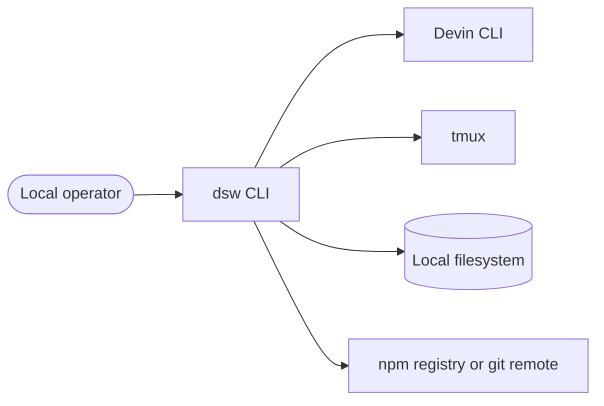
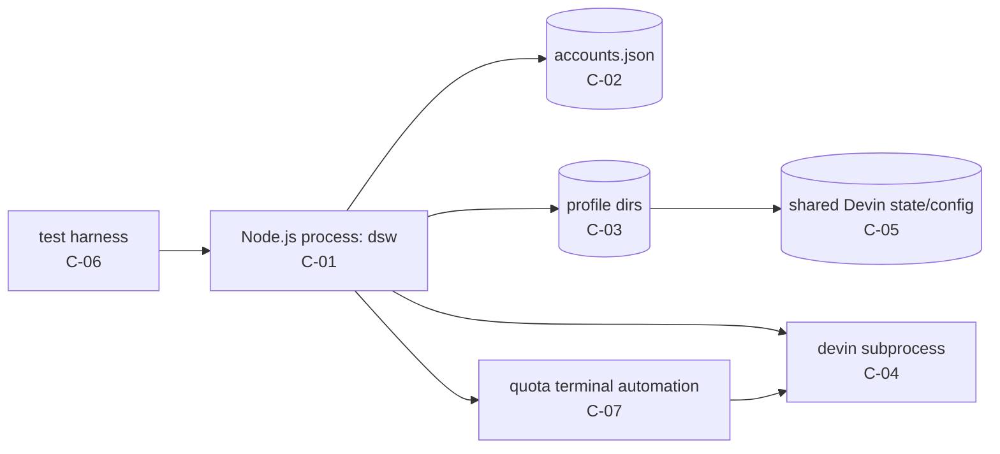
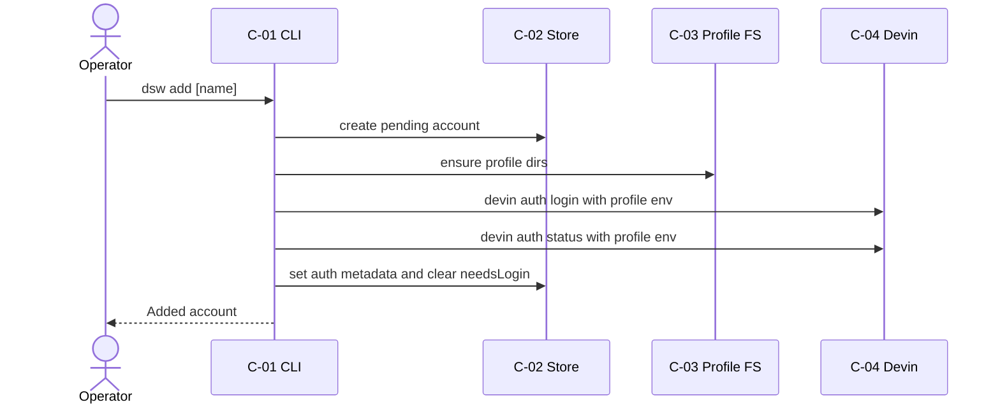
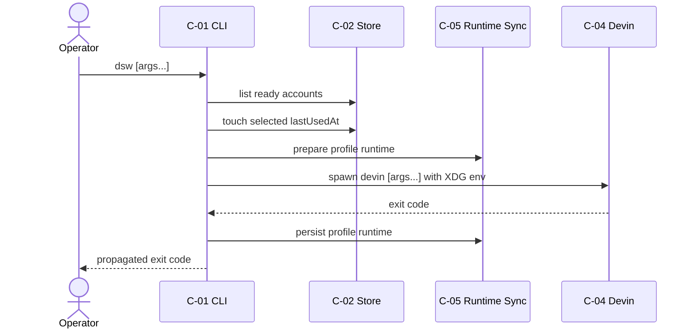
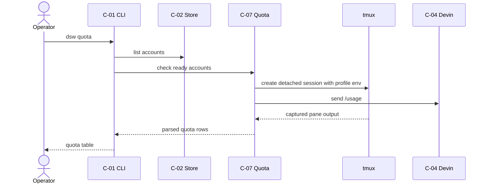
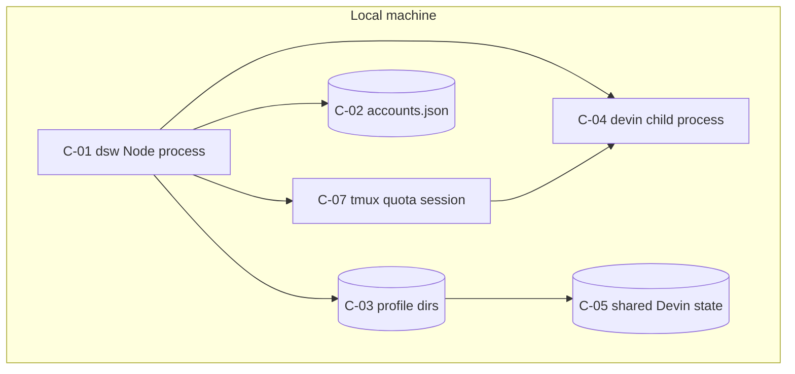

# Architecture - devin-switcher

**Version:** 1.1.0
**Date:** 2026-05-07
**Status:** Draft
**Source:** PRD v1.1.0, TECHSTACK v1.1.0, `src/`, `tests/`, `README.md`
**Owner:** itsddvn

---

## 1. Purpose

This document describes the local CLI architecture, module boundaries, runtime process model, profile filesystem layout, and architectural decisions inferred from the existing codebase.

## 2. Conventions

- Components use `C-{NN}`.
- Decisions use `AD-{NN}`.
- `Inferred` means extracted from current code/history without original design notes.

## 3. Context (C4 L1)

The operator runs `dsw` in a terminal. `dsw` reads/writes local files, spawns the external `devin` binary, and uses tmux for interactive quota checks. Update behavior may call git and npm. The product has no server-side component.

## 4. Containers (C4 L2)

All components run on the local host. Normal execution spawns `devin`; quota reporting adds short-lived tmux sessions that run Devin under each profile environment.

## 5. Components

### `C-01` CLI Router and Commands

**Responsibility:** Parse CLI arguments and execute command handlers.
**Type:** CLI process.
**Owned data:** None directly.
**Exposed interface:** `dsw`, `dsw list`, `dsw add`, `dsw remove`, `dsw login`, `dsw next`, `dsw use`, `dsw quota`, `dsw update`, `dsw doctor`.
**Consumes:** `C-02`, `C-03`, `C-04`, `C-05`, `C-07`.
**Tech:** `TS-LANG-01`, `TS-RT-02`, `TS-FW-03`.
**Source dir:** `src/cli/`.
**Process boundary:** Main Node.js process.
**Scaling:** Single local invocation.
**Failure mode:** Prints command-specific error and sets non-zero `process.exitCode`.
**Related FRs:** `FR-CLI-001`, `FR-CLI-002`, `FR-RUN-001`, `FR-RUN-002`, `FR-RUN-004`, `FR-RUN-005`, `FR-OPS-001`, `FR-OPS-002`, `FR-OPS-004`.
**Related BR:** `BR-OPS-01`.

### `C-02` Account Store

**Responsibility:** Persist and normalize account metadata.
**Type:** In-process library.
**Owned data:** Local JSON account store.
**Exposed interface:** `AccountStore` methods.
**Consumes:** Local filesystem.
**Tech:** `TS-LANG-01`, `TS-DATA-10`.
**Source dir:** `src/core/store.ts`.
**Process boundary:** In-process with `C-01`.
**Scaling:** Single local writer assumed.
**Failure mode:** Throws read/write validation errors; command catches top-level failures.
**Related FRs:** `FR-ACC-001`, `FR-ACC-002`, `FR-ACC-003`, `FR-ACC-004`.
**Related BR:** `BR-DATA-01`.

### `C-03` Profile Filesystem

**Responsibility:** Resolve, create, and remove per-account profile directories.
**Type:** In-process library.
**Owned data:** `profiles/<id>/data`, `profiles/<id>/config`, profile Devin paths.
**Exposed interface:** `resolveProfilePaths`, `ensureProfileDirs`, `removeProfileDir`.
**Consumes:** App path resolution.
**Tech:** `TS-LANG-01`, `TS-DATA-10`.
**Source dir:** `src/core/profile-paths.ts`, `src/config/paths.ts`.
**Process boundary:** In-process with `C-01`.
**Scaling:** One profile directory per account.
**Failure mode:** Filesystem errors abort the command.
**Related FRs:** `FR-PROF-001`, `FR-PROF-004`.
**Related BR:** `BR-SEC-01`, `BR-DATA-02`.

### `C-04` Devin Auth and Runner Adapter

**Responsibility:** Spawn Devin login/status/run commands under a profile environment.
**Type:** In-process adapter plus subprocess.
**Owned data:** None; Devin writes credentials and runtime state.
**Exposed interface:** `runDevinLogin`, `readAuthStatus`, `runDevinForAccount`.
**Consumes:** External `devin` binary.
**Tech:** `TS-LANG-01`, `TS-SEC-09`.
**Source dir:** `src/core/auth.ts`, `src/core/runner.ts`, `src/core/profile-env.ts`.
**Process boundary:** `devin` child process.
**Scaling:** One child process per invocation.
**Failure mode:** Child error/exit code is returned or converted to command error.
**Related FRs:** `FR-AUTH-001`, `FR-AUTH-002`, `FR-RUN-001`, `FR-RUN-002`, `FR-RUN-003`, `FR-RUN-004`.
**Related BR:** `BR-SEC-01`, `BR-AUTH-01`.

### `C-05` Shared Runtime Sync

**Responsibility:** Link shared Devin CLI state and sync non-auth config without leaking profile org id.
**Type:** In-process library.
**Owned data:** Symlinked profile `devin/cli`; merged config files.
**Exposed interface:** `prepareProfileRuntime`, `persistProfileRuntime`.
**Consumes:** Shared user Devin data/config directories.
**Tech:** `TS-LANG-01`, `TS-SEC-09`, `TS-DATA-10`.
**Source dir:** `src/core/profile-runtime.ts`, `src/core/profile-config.ts`.
**Process boundary:** In-process with `C-01`; affects filesystem before/after `C-04`.
**Scaling:** One shared state directory across profiles.
**Failure mode:** Filesystem merge/link errors abort the command.
**Related FRs:** `FR-PROF-002`, `FR-PROF-003`, `FR-PROF-005`.
**Related BR:** `BR-SEC-02`, `BR-DATA-03`.

### `C-06` Build and Test Harness

**Responsibility:** Typecheck, lint, build, and test the CLI with a fake Devin binary.
**Type:** Development tooling.
**Owned data:** Test sandboxes and fake Devin script.
**Exposed interface:** `npm test`, `npm run typecheck`, `npm run lint`, `npm run build`.
**Consumes:** `C-01` through integration tests.
**Tech:** `TS-BUILD-04`, `TS-TEST-05`, `TS-TEST-06`, `TS-BUILD-07`, `TS-BUILD-08`.
**Source dir:** `tests/`, `scripts/fake-devin.ts`.
**Process boundary:** Test runner process.
**Scaling:** Local/CI test runs.
**Failure mode:** Failing specs or build checks block release.
**Related FRs:** `FR-OPS-003`, `FR-OPS-004`.
**Related BR:** `BR-OPS-02`.

### `C-07` Quota Terminal Automation

**Responsibility:** Run Devin's interactive `/usage` command per ready account and parse quota output.
**Type:** In-process adapter plus tmux subprocesses.
**Owned data:** None; captures transient terminal output only.
**Exposed interface:** Quota collection and parser functions.
**Consumes:** `C-03`, `C-04` profile env construction, external `tmux`, external `devin`.
**Tech:** `TS-LANG-01`, `TS-RT-02`, `TS-SEC-09`, `TS-INFRA-11`.
**Source dir:** `src/core/quota.ts`, `src/cli/commands/quota.ts`, `scripts/ensure-tmux.js`.
**Process boundary:** tmux server/session plus Devin subprocess inside the pane.
**Scaling:** One short-lived tmux session per account during `dsw quota`.
**Failure mode:** Per-account quota failures are reported without stopping the whole scan; tmux absence is surfaced by doctor/postinstall.
**Related FRs:** `FR-RUN-005`, `FR-OPS-004`.
**Related BR:** `BR-AUTH-01`, `BR-OPS-03`.

## 6. Data Flow

### 6.1 Add Account

If login fails, explicit named accounts are marked recoverable through `dsw login`; unnamed pending accounts are rolled back.

### 6.2 Run Devin

### 6.3 Check Quota

## 7. Deployment Topology

### 7.1 Environment matrix

| Environment | Host model | Components | Network binds |
|-------------|------------|------------|---------------|
| local dev | User workstation | all | none |
| CI | Ephemeral runner | `C-06`, fake `devin` | none |
| production use | User workstation | `C-01` through `C-05` | none |

### 7.2 Network

- Public ingress: none.
- Internal network: none.
- Outbound egress: only external tools invoked by update commands or Devin CLI behavior.

### 7.3 Process layout

## 8. Integration Points

| External | Direction | Protocol | Auth | Rate limit | Failure handling |
|----------|-----------|----------|------|------------|------------------|
| Devin CLI | outbound subprocess | local process/env/files | Devin-managed credentials | unknown | Propagate exit, mark login failures, doctor detection. |
| tmux | outbound subprocess | local terminal session | profile env passed by `dsw` | n/a | Report per-account quota failure; doctor/postinstall detect missing binary. |
| npm | outbound subprocess | local command/network | user npm config | npm controlled | Stop update on non-zero exit. |
| git | outbound subprocess | local command/network | user git config | remote controlled | Stop update on non-zero exit. |

## 9. Cross-Cutting Concerns

| Concern | Approach | Component owners |
|---------|----------|------------------|
| AuthN/Z | Delegated to Devin CLI; `dsw` isolates env paths. | `C-04`, `C-05` |
| Observability | Terminal stdout/stderr only. | `C-01` |
| Config | `DSW_DATA_HOME`, `DSW_CONFIG_HOME`, XDG env during Devin subprocesses. | `C-03`, `C-05` |
| Secrets | Credentials are written by Devin inside profile data dir; auth-like strings are redacted in parser output. | `C-04`, `C-05` |
| Healthchecks | `dsw doctor` checks paths, `devin --version`, and `tmux -V`. | `C-01`, `C-04`, `C-07` |
| Backpressure | Not applicable for a local synchronous CLI. | n/a |

## 10. Architectural Decisions (ADR-lite)

### `AD-01` Use a local JSON account store

**Status:** Inferred
**Date:** 2026-05-07
**Context:** The CLI is single-user, local, and stores metadata rather than credentials.
**Decision:** Store account metadata in a JSON file with file version 1.
**Consequences:**
- Positive: Minimal dependencies and easy backup/inspection.
- Negative: No cross-process locking.
- Neutral: Future schema changes need migration logic.
**Alternatives considered:**
- SQLite - rejected as unnecessary for current scope.
**Related TS:** `TS-DATA-10`
**Related components:** `C-02`
**Source:** `src/core/store.ts:18`

### `AD-02` Isolate credentials with XDG profile env

**Status:** Inferred
**Date:** 2026-05-07
**Context:** Devin writes credentials under XDG-derived data paths.
**Decision:** Spawn Devin with profile-specific `XDG_DATA_HOME` and `XDG_CONFIG_HOME`.
**Consequences:**
- Positive: Each account gets separate credentials.
- Negative: Depends on Devin respecting XDG paths.
- Neutral: Profile directories must be created before spawn.
**Alternatives considered:**
- Swapping credential files in place - rejected because it risks overwriting global auth.
**Related TS:** `TS-SEC-09`
**Related components:** `C-03`, `C-04`, `C-05`
**Source:** `src/core/profile-env.ts:4`

### `AD-03` Share Devin CLI state through a symlink

**Status:** Inferred
**Date:** 2026-05-07
**Context:** Credentials must be isolated, but sessions/logs/trusted workspaces should remain shared.
**Decision:** Link each profile `devin/cli` directory to the shared user-level Devin CLI state.
**Consequences:**
- Positive: Operators keep shared runtime continuity across accounts.
- Negative: Symlink support and migration behavior must be tested.
- Neutral: Existing isolated CLI state is copied before linking.
**Alternatives considered:**
- Fully isolated CLI state - rejected because it loses useful session/workspace state.
**Related TS:** `TS-SEC-09`, `TS-DATA-10`
**Related components:** `C-05`
**Source:** `src/core/profile-runtime.ts:25`

### `AD-04` Rotate by LRU by default

**Status:** Inferred
**Date:** 2026-05-07
**Context:** Quota parsing was removed; current code needs a deterministic local selection rule.
**Decision:** Default run selects the least-recently-used ready account.
**Consequences:**
- Positive: No dependence on undocumented quota output.
- Negative: Does not account for actual quota availability.
- Neutral: `dsw next` remains available for list-order control.
**Alternatives considered:**
- Quota-based automatic selection - deferred; explicit `dsw quota` reports state without changing default selection.
**Related TS:** `TS-LANG-01`
**Related components:** `C-01`, `C-02`, `C-04`
**Source:** `src/core/runner.ts:31`, `prd.md:2`

### `AD-05` Use fake Devin for integration tests

**Status:** Inferred
**Date:** 2026-05-07
**Context:** Tests must not touch real Devin credentials.
**Decision:** Integration tests prepend a fake `devin` shim that runs `scripts/fake-devin.ts`.
**Consequences:**
- Positive: Tests are deterministic and safe for local credentials.
- Negative: Real Devin output changes still require manual/doctor validation.
- Neutral: Fake behavior must track the subset `dsw` consumes.
**Alternatives considered:**
- Running real Devin in tests - rejected due to credential risk.
**Related TS:** `TS-TEST-05`, `TS-TEST-06`
**Related components:** `C-06`
**Source:** `tests/integration/cli.spec.ts:21`, `scripts/fake-devin.ts:1`

### `AD-06` Use tmux for quota reporting

**Status:** Adopted
**Date:** 2026-05-07
**Context:** `devin -p "/usage"` uses the default credential in observed behavior, while interactive `/usage` inside a profile session returns the desired account's quota.
**Decision:** `dsw quota` creates short-lived tmux sessions with each account's profile environment, sends `/usage`, captures output, parses quota fields, and cleans up the session.
**Consequences:**
- Positive: Quota checks use the managed account credentials instead of the default credential.
- Negative: tmux becomes an operating-system dependency for quota reporting.
- Neutral: Per-account failures are visible in the quota table.
**Alternatives considered:**
- `devin -p "/usage"` - rejected because it did not go through `dsw` profile credentials.
- Direct API integration - rejected because no documented API contract is present.
**Related TS:** `TS-INFRA-11`, `TS-SEC-09`
**Related components:** `C-01`, `C-07`
**Source:** `src/core/quota.ts:1`, `scripts/ensure-tmux.js:1`

## 11. Risks & Trade-offs

| Risk | Impact | Mitigation | Tracked in |
|------|--------|------------|------------|
| Concurrent store writes can race. | Metadata loss or stale `lastUsedAt`. | Keep single-operator assumption; add file lock if needed. | PRD section 8 |
| Devin output changes. | Auth metadata parsing breaks. | Redact and parse minimal fields; cover fake output; run doctor manually. | PRD section 8 |
| Package lock root version stale. | Release metadata confusion. | Refresh lock file in maintenance work. | PRD section 8 |
| tmux unavailable. | `dsw quota` cannot automate interactive `/usage`. | Postinstall check/install and doctor diagnostics. | PRD section 8 |

---

## Traceability

### Components -> SRS

| Component | FRs implemented |
|-----------|-----------------|
| `C-01` | `FR-CLI-001`, `FR-CLI-002`, `FR-RUN-001`, `FR-RUN-002`, `FR-RUN-004`, `FR-RUN-005`, `FR-OPS-001`, `FR-OPS-002`, `FR-OPS-004` |
| `C-02` | `FR-ACC-001`, `FR-ACC-002`, `FR-ACC-003`, `FR-ACC-004` |
| `C-03` | `FR-PROF-001`, `FR-PROF-004` |
| `C-04` | `FR-AUTH-001`, `FR-AUTH-002`, `FR-RUN-001`, `FR-RUN-002`, `FR-RUN-003`, `FR-RUN-004` |
| `C-05` | `FR-PROF-002`, `FR-PROF-003`, `FR-PROF-005` |
| `C-06` | `FR-OPS-003`, `FR-OPS-004` |
| `C-07` | `FR-RUN-005`, `FR-OPS-004`, `NFR-COMPAT-002` |

### Components -> TECHSTACK

| Component | TS IDs consumed |
|-----------|-----------------|
| `C-01` | `TS-LANG-01`, `TS-RT-02`, `TS-FW-03` |
| `C-02` | `TS-LANG-01`, `TS-DATA-10` |
| `C-03` | `TS-LANG-01`, `TS-DATA-10` |
| `C-04` | `TS-LANG-01`, `TS-SEC-09` |
| `C-05` | `TS-LANG-01`, `TS-SEC-09`, `TS-DATA-10` |
| `C-06` | `TS-BUILD-04`, `TS-TEST-05`, `TS-TEST-06`, `TS-BUILD-07`, `TS-BUILD-08` |
| `C-07` | `TS-LANG-01`, `TS-RT-02`, `TS-SEC-09`, `TS-INFRA-11` |

### ADRs -> Components

| AD | Affects |
|----|---------|
| `AD-01` | `C-02` |
| `AD-02` | `C-03`, `C-04`, `C-05` |
| `AD-03` | `C-05` |
| `AD-04` | `C-01`, `C-02`, `C-04` |
| `AD-05` | `C-06` |
| `AD-06` | `C-01`, `C-07` |

## Change Log

| Version | Date | Author | Change |
|---------|------|--------|--------|
| 1.1.0 | 2026-05-07 | itsddvn | Added direct account selection, quota terminal automation, tmux integration, and related ADR/traceability. |
| 1.0.0 | 2026-05-07 | itsddvn | Initial brownfield architecture extraction from current code. |
