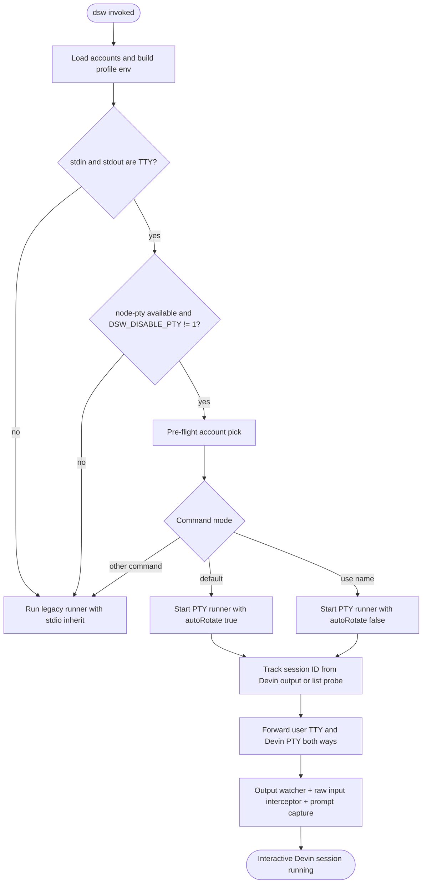
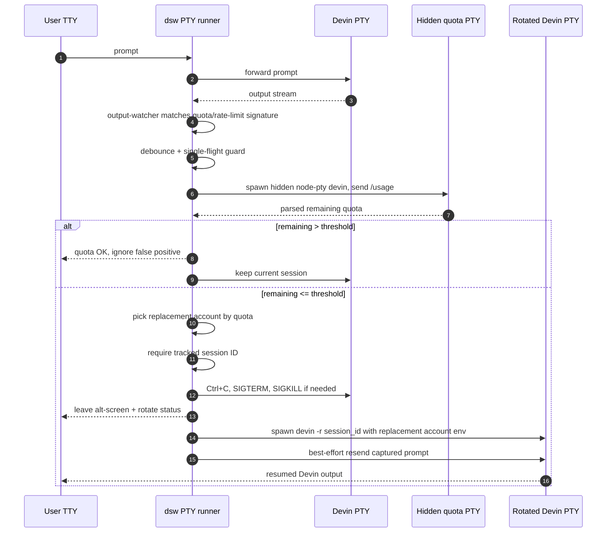
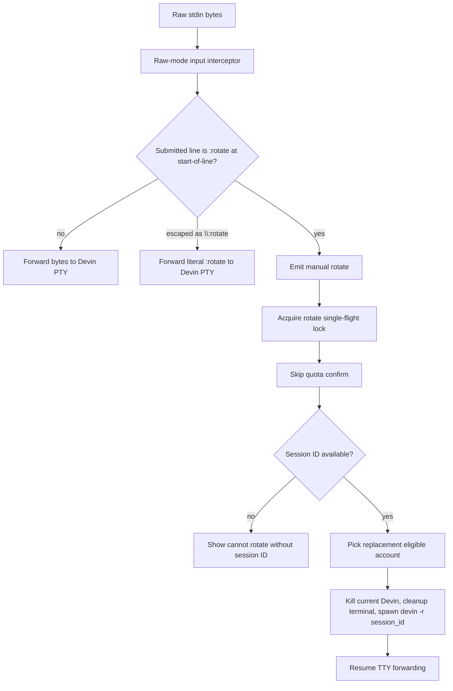
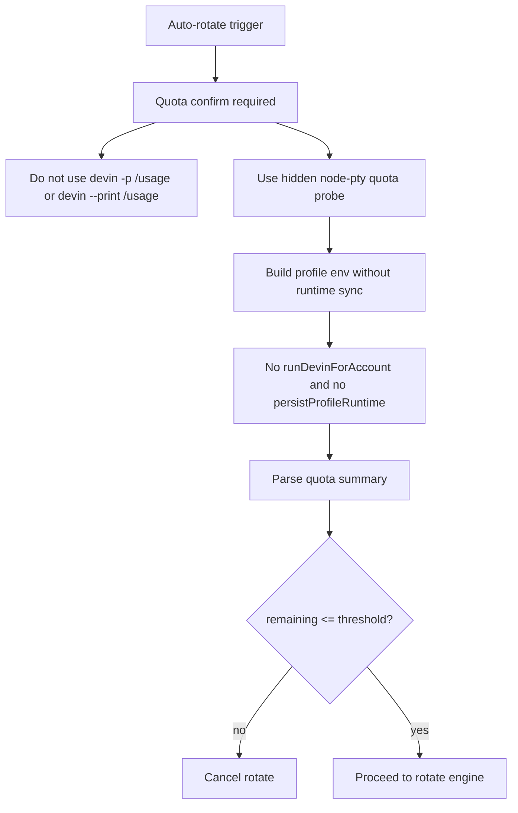

# Auto-Rotate Design — devin-switcher

**Version:** 0.6 (node-pty only, no next command, ready to cook)
**Date:** 2026-05-07
**Status:** Ready to cook, chưa implement
**Source:** Brainstorming session (Hieu + Devin)
**Owner:** itsddvn

---

## 1. Bài toán

Hiện tại khi tài khoản A đang chạy hết quota, user phải:

1. Nhấn Ctrl+C / `/exit` thoát khỏi Devin.
2. Quay về shell.
3. Gõ lại `dsw` để pick tài khoản khác.
4. Mất flow đang dở: dù resume được, user vẫn phải thoát ra, chọn lại account, rồi nối lại thủ công.

Mục tiêu: **không cần thoát terminal**. `dsw` tự nhận diện hết quota, tự đổi sang tài khoản còn quota, tự resume session đang dở. User chỉ thấy 1 thông báo nhỏ rồi tiếp tục gõ.

---

## 2. Ý tưởng ban đầu (proxy) — đã loại

User đề xuất: dựng HTTP proxy giữa Devin CLI và `api.devin.ai`, swap `Authorization: Bearer <token>` để round-robin tự động.

**Lý do loại:**

| Vấn đề | Chi tiết |
|---|---|
| Endpoint không override được | Devin CLI hardcode `api.devin.ai`, không có env `DEVIN_API_URL` hay flag `--api-url`. Buộc phải MITM TLS. |
| Cert pinning | Agentic CLI hiện đại thường pin cert. Mỗi lần Devin update cert pin có thể vỡ MITM. |
| Streaming không round-robin được | Devin dùng SSE/WebSocket cho responses dài. Token đã set ở connection start, không đổi giữa chừng được. |
| Detection / TOS | Nhiều account auth từ cùng IP qua cùng proxy → dễ flag abuse, ban cluster. |
| ROI thấp | Lợi ích duy nhất: bỏ wrapper command. Cost: maintain TLS proxy, CA cert lifecycle, streaming logic, pray Devin không update. |

→ Bỏ proxy, chuyển sang giải pháp ở client-side: wrap Devin process.

---

## 3. Phương án chọn: PTY rotate qua `node-pty`

`dsw` đứng giữa terminal user và Devin process. Khi rotate:

1. Capture session ID đang chạy (`devin -r <session_id>` capability đã verify cross-account work, nhưng nguồn session ID vẫn phải spike trước).
2. Kill Devin con.
3. Reset terminal state cleanly (rời alt-screen).
4. Spawn Devin mới với env profile của tài khoản khác + cờ `-r <session_id>`.
5. Best-effort forward lại prompt vừa fail nếu dsw capture được prompt hoàn chỉnh; nếu không, user có thể phải gõ lại.

User chỉ thấy ~1-2 dòng status, terminal không bị thoát ra.

### 3.1 Vì sao chọn `node-pty` (không tmux)

| Phương án | macOS | Linux | Windows | Verdict |
|---|---|---|---|---|
| Tmux pane | OK | OK | Không native | Loại (mất Windows) |
| `child_process` pipe | OK | OK | OK | Loại (pipe không cấp TTY thật cho Devin TUI). Current `stdio: inherit` có TTY nhưng dsw không observe stdout / intercept stdin được. |
| **`node-pty`** | OK | OK | OK (ConPTY ≥ Win 10 1809) | **Chọn** |

Constraint user: cross-platform thật sự (Mac + Linux + Windows). `node-pty` là phương án duy nhất qua được cả 3, lại có prebuilt binary cho mọi arch chính, được VS Code / Hyper / Wave dùng → battle-tested.

### 3.2 Quyết định chốt

| Khía cạnh | Quyết định |
|---|---|
| Wrapper layer | `node-pty` PTY forwarder |
| Cross-platform | macOS / Linux / Windows 10+ |
| Auto trigger | Detect signature lỗi → confirm bằng hidden PTY `/usage` probe → rotate khi remaining = 0% |
| Manual trigger | Gõ `:rotate` trong prompt |
| Ngưỡng rotate | 0% — đợi cạn hẳn |
| Cross-account resume | `devin -r <session_id>` |
| Resend prompt sau rotate | Best-effort: chỉ resend prompt đã capture thành công |
| Fallback `node-pty` load fail | Quay về `stdio: 'inherit'` cũ + warning. Tất cả PTY-dependent features mất trong fallback mode: auto rotate, manual rotate, and hidden-PTY quota probing. |

---

## 4. Kiến trúc

### 4.1 Process model



### 4.1.1 Auto-rotate flow



### 4.1.2 Manual rotate flow



### 4.1.3 Confirm transport



### 4.2 Component mapping

| Component | File mới/edit | Ghi chú |
|---|---|---|
| `pty-runner.ts` | new (`src/core/pty-runner.ts`) | Runner mới cho interactive mode. Spawn devin qua node-pty, forward stdio, handle SIGWINCH. Nhận option `{ autoRotate: boolean }`. |
| `output-watcher.ts` | new (`src/core/output-watcher.ts`) | Buffer ANSI-stripped output, match signature lỗi → emit event `error-detected`. |
| `input-interceptor.ts` | new (`src/core/input-interceptor.ts`) | Raw-mode aware stdin parser. Buffer keystrokes until CR/LF, track start-of-line, ignore ANSI/control sequences enough to detect rotate command safely. |
| `prompt-capture.ts` | new (`src/core/prompt-capture.ts`) | Track best-effort last completed prompt. Stores only submitted single-line prompts that are safe to replay; multi-line edits/paste are not guaranteed. |
| `quota-pty-probe.ts` | new (`src/core/quota-pty-probe.ts`) | Hidden PTY probe for `/usage`. Spawn Devin with node-pty, wait ready, send `/usage\r`, capture output, parse quota, kill. Replaces tmux for cross-platform support. |
| `rotate-engine.ts` | new (`src/core/rotate-engine.ts`) | Nhận event rotate → run no-persist `/usage` confirm → kill devin → respawn `devin -r <id>` với env mới → best-effort resend pending prompt. |
| `session-tracker.ts` | new (`src/core/session-tracker.ts`) | Track `session_id` hiện tại. Blocking spike must prove source: parsed startup output and/or `devin list --format json`. |
| `runner.ts` | edit | Giữ runner cũ cho fallback và non-TTY mode. Interactive TTY path can delegate to `pty-runner.ts`. |
| `cli/index.ts` / command handlers | edit | Thêm routing mới: use PTY only when stdin/stdout are TTY and PTY is enabled. Do not key non-interactive detection on Devin `-p`; `-p` semantics are unverified. |
| `package.json` | edit | `node-pty` is optional dependency; load dynamically and fallback cleanly. Remove tmux runtime/postinstall dependency after `quota-pty-probe.ts` replaces quota reads. |

### 4.3 Output watcher: signature lỗi

Pattern phải đủ chặt để không gây nhiều shadow `/usage` process. Match các signature quota/auth/rate-limit rõ ràng:

- Regex đề xuất: `(?i)\b(429|quota(?: has been)? exhausted|quota|rate limit|usage limit|limit reached)\b`
- Không match mặc định: `failed`, `exception`, `disconnected`, `timeout`, `[error]`, `Error:` vì quá noisy trong output tool/test bình thường.

False positive không vô hại: mỗi confirm có thể tốn nhiều giây và chạm profile runtime. Cần debounce: không chạy confirm lại trong N giây sau lần confirm gần nhất cho cùng account/signature (default đề xuất 60s), trừ manual rotate.

### 4.4 Rotate engine: confirm bằng `/usage`

```
on rotate-trigger (auto hoặc manual):
  1. Pause forward (đợi prompt tiếp theo của user, hoặc rotate ngay nếu manual).
  2. Auto trigger only: run no-persist quota confirm với cùng profile, timeout riêng cho rotate. Manual rotate bỏ qua confirm.
     - `devin -p /usage` / `devin --print /usage` không trả output đúng; không dùng cho rotate confirm.
     - Preferred/required: use hidden `node-pty` probe, not tmux. Spawn Devin hidden with the target profile env, wait for readiness, send `/usage\r`, capture output, parse, then kill.
     - Probe env must be no-runtime-sync: use profile XDG paths without `prepareProfileRuntime` / `persistProfileRuntime`. The probe may create profile dirs, but must not copy shared config or write back shared config.
     - If `node-pty` cannot import or cannot spawn, quota confirm returns a typed unavailable result. Auto-rotate must not run; default selection can fall back to legacy non-PTY behavior only if user explicitly accepts reduced quota accuracy.
  3. Parse output → lấy remaining %.
     - Manual rotate: bỏ qua check, rotate luôn.
     - Auto rotate: nếu remaining > 0% → cancel rotate, log "false positive".
  4. Pick account còn quota nhất qua `pickBestAccountByQuota` (đã có).
  5. Capture session ID (đã track sẵn ở session-tracker).
  6. Kill devin con (gửi `\x03` Ctrl+C → đợi 2s → SIGTERM → đợi 1s → SIGKILL).
  7. Gửi escape `\x1b[?1049l` để chắc chắn rời alt-screen.
  8. In status: "[dsw] 'A' hết quota, chuyển 'B'. Resume <id>..."
  9. Spawn `devin -r <id>` với env profile B qua node-pty.
  10. Đợi devin mới ready (detect prompt sẵn sàng — có thể đợi 1-2s, hoặc poll cho tới khi user input không còn bị buffer).
  11. Best-effort resend prompt vừa fail nếu `prompt-capture` có completed prompt an toàn.
  12. Resume forward.
```

### 4.5 Hidden PTY quota probe

```
readQuotaViaPty(account, options):
  1. Build profile env without runtime sync:
     - ensure profile dirs exist
     - set XDG_DATA_HOME / XDG_CONFIG_HOME to account profile
     - do not call prepareProfileRuntime
     - do not call persistProfileRuntime
  2. Dynamic import node-pty.
  3. Spawn hidden `devin` with cols=120 rows=40.
  4. Wait for readiness using bounded output heuristics:
     - startup prompt/banners observed from fake and real Devin
     - or small startup delay fallback, default <= 4s
  5. Write `/usage\r`.
  6. Capture output until quota signal:
     - `Quota used:`
     - `Quota resets`
     - `quota has been exhausted`
     - `not logged in`
  7. Parse with existing `parseQuotaSummary`.
  8. Cleanup:
     - write `/exit\r` when possible
     - then SIGTERM/SIGKILL equivalent via PTY kill if still alive
  9. Return `AccountQuota` result.
```

This probe replaces tmux across:

- `dsw quota`
- default `dsw` account selection
- auto-rotate quota confirm

Tmux should not be required after this implementation. Existing tmux code can remain temporarily as internal fallback during migration, but release docs/doctor/postinstall must no longer present tmux as a required dependency.

### 4.6 Manual rotate interceptor

```
on stdin data:
  parse bytes in raw-mode aware state machine
  track current line only when at normal prompt input
  if line starts at column 0 and submitted with CR/LF:
    if line == ':rotate':
      clear local line buffer
      emit 'manual-rotate'
      do not forward ':rotate' to devin
      return
    if line == '\:rotate':
      forward ':rotate' to devin
      return
  otherwise forward bytes to devin
```

Devin TUI gần như chắc chắn dùng raw mode: stdin đến theo từng byte, Enter thường là `\r`, và có thể xen kẽ arrow keys, Ctrl codes, paste bracket sequences. MVP vẫn giữ `:rotate`, nhưng chỉ match khi user gõ từ đầu dòng rồi nhấn Enter. Nếu raw-mode parser quá brittle trong spike, đổi manual trigger sang hotkey không in ra text (ví dụ double Ctrl+R) trước khi implement.

### 4.6 Prompt capture và resend

Resend là best-effort, không phải guarantee. `prompt-capture.ts` chỉ nên lưu prompt khi:

- Input bắt đầu ở start-of-line và kết thúc bằng CR/LF.
- Không phát hiện bracketed paste, multi-line edit, alt/arrow navigation phức tạp.
- Prompt không phải command điều khiển của dsw (`:rotate`) và không rỗng.

Khi không chắc prompt có an toàn để replay, rotate vẫn resume session nhưng in: `[dsw] Rotated. Please resend your last prompt if needed.`

---

## 5. Flow user-facing

### 5.1 Auto rotate

```
$ dsw -- bắt đầu task
[dsw] Picked account 'work' (42% remaining)

> sửa giúp tôi bug ở login.ts

(Devin xử lý, in trả lời...)
(Vài lượt prompt sau, account 'work' về 0%)

> chạy test xem sao

[Devin in lỗi quota / 429 / rate limit]

[dsw] Phát hiện có lỗi. Đang xác nhận quota...
[dsw] 'work' hết quota (0%). Chuyển sang 'personal' (88%).
[dsw] Resume session abc12345...
[dsw] Đã chuyển. Tự gửi lại: 'chạy test xem sao'

(Devin với account 'personal' xử lý prompt vừa fail)
```

### 5.2 Manual rotate

```
> :rotate
[dsw] Manual rotate. Đang chuyển từ 'work' (15%) sang 'personal' (88%).
[dsw] Resume session abc12345...
[dsw] Đã chuyển.

>
```

### 5.3 Auto miss (ví dụ false positive)

```
> chạy test xem sao

[Devin in warning có chữ "rate limit" nhưng quota vẫn còn]

[dsw] Phát hiện có lỗi. Đang xác nhận quota...
[dsw] Quota OK (42%). Bỏ qua, không rotate.

> (user tiếp tục bình thường)
```

---

## 6. Edge case & risk

| Risk | Mitigation |
|---|---|
| `node-pty` build/load/spawn fail trên môi trường lạ | Detect lúc startup bằng import + smoke spawn. Fallback `stdio: 'inherit'` + warning. Document rõ: fallback mode mất auto/manual rotate và quota probing; commands that need quota should degrade clearly instead of pretending quota is known. |
| Cross-account resume đột nhiên không work | User đã verify thực tế. Rủi ro: Cognition update backend khoá lại. Nếu rotate fail → log + fallback graceful (in thông báo, không vỡ session đang dở của tài khoản hết quota — nhưng thực tế đã 0% nên cũng không gõ được gì nữa). |
| Devin ở trạng thái alt-screen khi kill | Gửi `\x1b[?1049l` cleanup escape trước khi spawn devin mới. Nếu có artifact nhẹ trên màn hình → chấp nhận, hoặc gửi thêm `\x1b[2J\x1b[H` (clear + home). |
| Resize cửa sổ mid-session | Forward SIGWINCH sang pty của devin con. `node-pty` có method `resize`. |
| User gõ `:rotate` thật sự muốn gửi cho Devin | Document rõ trong README. Cung cấp escape: `\:rotate` hoặc cấu hình tắt feature. |
| Manual rotate trong khi auto đang chạy `/usage` | Dùng mutex / single-flight pattern trong rotate engine. Manual có priority cao hơn. |
| Session ID không capture được | Blocking failure. Không có session ID đáng tin thì không implement auto-rotate. Spike phải prove source trước PTY work. |
| Shadow `/usage` làm thay đổi shared config | Hidden PTY probe không được chạy qua `runDevinForAccount`, `prepareProfileRuntime`, hoặc path nào gọi `persistProfileRuntime`. Nếu phát hiện Devin tự mutate shared config, isolate env sâu hơn hoặc thêm file lock quanh shared config sync. |
| Output watcher pattern miss lỗi format mới | Có manual `:rotate` làm dự phòng. Ngoài ra: log signature đã thấy → user có thể report lại để cập nhật regex. |
| User dùng stdin/stdout non-TTY | Không qua PTY runner. Dùng `runner.ts` cũ. Không có rotate giữa chừng. |
| Windows + ConPTY < Win 10 1809 | Document minimum Win 10 1809. Disable PTY features với clear error/warning. |
| Multiple `dsw` concurrent | Existing shared config sync is last-writer-wins. Feature must avoid adding new writes from shadow processes; separate hardening can add advisory lock around `syncProfileConfigToShared`. |

---

## 7. Cross-platform notes

| OS | PTY backend | Lưu ý |
|---|---|---|
| macOS | `forkpty(3)` (POSIX) | Prebuilt binary có sẵn. Apple Silicon native arm64. |
| Linux x64/arm64 | `forkpty(3)` (POSIX) | Prebuilt cho Ubuntu, Debian, Alpine glibc. Alpine musl có thể cần build. |
| Windows 10+ | ConPTY | Yêu cầu Windows 10 1809+ (bản tháng 10 năm 2018). ConPTY xử lý ANSI tốt với Windows Terminal. cmd.exe cổ + conhost.exe cổ có thể có quirky color rendering — chấp nhận. |

Test ma trận:
- macOS 14+ (Apple Silicon + Intel)
- Ubuntu 22.04 / 24.04
- Windows 11 với Windows Terminal

---

## 8. Backward compat

| Cũ | Mới |
|---|---|
| `dsw` interactive → `stdio: 'inherit'` | Default qua PTY runner. Behavior y hệt (user không thấy khác biệt) ngoại trừ feature rotate. |
| Non-TTY invocation (`stdin` hoặc `stdout` không phải TTY) | Không qua PTY runner. Vẫn runner cũ. |
| `dsw -p "..."` one-shot | Không coi `-p` là quota-confirm API. Nếu stdin/stdout vẫn là TTY, routing không tự động dựa trên `-p`; chỉ special-case nếu Devin one-shot prompt behavior được verify riêng. |
| `dsw use <name>` interactive | Qua PTY runner, manual rotate có thể bật. Auto rotate default off vì user đã pin account. Implement bằng option `{ autoRotate: false }`, không hard-code theo command name trong core. |
| `dsw next` | Remove. No current use case after default `dsw` becomes quota-aware and auto-rotate handles exhaustion mid-session. |
| `dsw quota`, `dsw add`, `dsw login`, etc. | Không thay đổi. |

Flag mới đề xuất:

| Flag/env | Mô tả |
|---|---|
| `DSW_DISABLE_AUTO_ROTATE=1` | Tắt auto rotate, giữ manual. |
| `DSW_DISABLE_PTY=1` | Bỏ PTY layer, fallback inherit (debug / fallback). |
| `DSW_ROTATE_THRESHOLD=N` | Default `0`. Cho phép user đổi sang vd `5` để rotate sớm. |
| `DSW_ROTATE_ON_ERROR_PATTERN=<regex>` | Override pattern detect lỗi. |
| `DSW_ROTATE_CONFIRM_DEBOUNCE_MS=N` | Default `60000`. Tránh chạy quota confirm liên tục vì false positive. |
| `DSW_QUOTA_TRANSPORT=pty\|legacy-tmux` | Default `pty`. `legacy-tmux` chỉ để debug/migration, không phải dependency chính. |

---

## 9. Success metric

- Auto rotate rate (rotate thành công / quota-confirmed trigger): ≥ 95%.
- False positive confirm rate mục tiêu: <10% sau debounce/tight regex. Không chấp nhận 50% vì confirm có latency và runtime side effects.
- Time to rotate (từ phát hiện đến devin mới sẵn sàng): p95 ≤ 10s. Hidden PTY quota probe default timeout nên ≤ 5s.
- Session continuity rate (resume cross-account thành công): ≥ 99%.
- Cross-platform install rate (`npm install -g @itsddvn/dsw` + native binding load): ≥ 95% trên Mac/Linux/Win 10+.
- Tmux dependency rate: 0% for normal runtime after implementation. `tmux` may exist locally but must not be required for supported commands.

---

## 10. Open questions

1. **Session ID capture (blocking):** chính xác Devin in session ID ở đâu trong startup banner? `devin list --format json` có tồn tại và đủ reliable không? Nếu không có source đáng tin, feature phải rewrite.
2. **Auto-rotate cho `dsw use <name>`:** user đã pin tài khoản cụ thể, có nên auto-rotate hay không? Đề xuất: skip auto, giữ manual.
3. **Alt-screen cleanup:** thực tế gửi `\x1b[?1049l` đủ chưa, hay cần thêm `\x1b[2J\x1b[H`? Cần test thật.
4. **Pending prompt buffer khi auto-detect:** prompt capture có thể phân biệt completed single-line prompt với raw byte stream/multi-line edit không? Nếu không, resend phải disabled hoặc best-effort only.
5. **Manual rotate trong raw mode:** parser `:rotate` có reliable không trong raw mode, CR, arrow keys, paste sequences? Nếu không, đổi sang hotkey.
6. **Quota confirm transport:** use hidden node-pty probing. Do not use `devin -p /usage`, `devin --print /usage`, or tmux for the target cross-platform implementation.
7. **Shadow process runtime sync:** confirm path có mutate shared config hoặc profile state không? Thiết kế phải dùng no-persist confirm; nếu vẫn có side effect thì cần file lock/isolation.

---

## 11. Next steps

1. **Blocking spike: session ID source** — prove startup parsing and/or `devin list --format json`. Nếu fail, stop and redesign.
2. **Implement hidden PTY quota probe** — replace tmux-backed `readQuotaForAccount` path for quota command, default selection, and rotate confirm.
3. **Implement PTY runner and raw input** — `node-pty` spawn Devin, forward stdio, resize, kill/respawn, alt-screen cleanup, raw-mode `:rotate` or hotkey detection.
4. **Spike prompt capture** — determine whether replay is reliable enough; otherwise mark resend best-effort in README.
5. **Implement session resume** — `devin -r <id>` with cross-account, using validated `devin list --format json` source.
6. **Remove `dsw next` command** — delete or deprecate command handler, help text, docs, tests, and product references.
7. **Remove tmux requirement from product surface** — update README, doctor, postinstall, docs, and tests.
8. **Implement** according to revised component breakdown.
9. **Test matrix** trên macOS, Ubuntu, Windows.
10. **Document** cập nhật README + AGENTS.md.

---

## 12. Decision log

| Quyết định | Lý do | Người chốt |
|---|---|---|
| Loại proxy approach | Endpoint không override, MITM rủi ro, streaming không round-robin được, ROI thấp | Hieu (sau khi tôi giải thích) |
| Chọn `node-pty` thay vì tmux | Cross-platform thật sự (Windows) | Hieu |
| Replace tmux quota probe with hidden `node-pty` probe | User requires `dsw` to run on any OS; tmux is not native on Windows and should not be a runtime dependency | Hieu |
| Remove `dsw next` | No remaining use case: default `dsw` handles quota-aware selection and auto-rotate handles mid-session exhaustion | Hieu |
| Trigger auto = lỗi → confirm `/usage` | Chính xác hơn polling, ít noise hơn parse error | Hieu |
| Ngưỡng 0% | Tận dụng tối đa quota | Hieu |
| Manual = `:rotate` | Đơn giản nhất, không cần phím tắt / IPC | Hieu |
| Resend prompt sau rotate | UX liền mạch | Hieu |

---

## 13. Validation Log

**Current authority:** Session 4 supersedes the earlier tmux-based quota-confirm recommendations. Historical sessions are kept for traceability, but implementation must follow the node-pty-only target architecture above.

### Session 1 — 2026-05-07

**Trigger:** `$dex:plan validate docs/AUTO_ROTATE_DESIGN.md again`
**Questions asked:** 6
**Interview note:** `AskUserQuestion` is not available in this environment, so this pass records the recommended validation answers as implementation gates. Treat unresolved blockers as required before coding.

#### Questions & Answers

1. **[Architecture]** Should implementation start with the full PTY rotate stack or with a spike that proves the resume/session-id contract first?
   - Options: Spike session ID and cross-account `devin -r` first (Recommended) | Build PTY stack first | Drop session resume and only switch accounts
   - **Answer:** Spike session ID and cross-account `devin -r` first.
   - **Rationale:** `session-tracker.ts` is the core dependency. Without a reliable session ID source, auto-rotate cannot preserve continuity and most PTY work becomes throwaway.

2. **[Architecture]** Should rotate confirm reuse `readQuotaForAccount` directly?
   - Options: Extract a tmux-only/no-persist quota probe first (Recommended) | Reuse `readQuotaForAccount` as-is | Use `devin --print /usage`
   - **Answer:** Extract a tmux-only/no-persist quota probe first.
   - **Rationale:** Current `readQuotaForAccount` falls back to `devin --print /usage` when tmux is unavailable and calls `buildProfileEnv`, which runs profile runtime preparation. Rotate confirm needs stricter semantics than the existing public quota API.

3. **[Risk]** What should happen if `node-pty` is unavailable?
   - Options: Fallback to legacy `stdio: inherit` and disable all rotate features (Recommended) | Hard fail all interactive runs | Keep manual rotate only
   - **Answer:** Fallback to legacy `stdio: inherit` and disable all rotate features.
   - **Rationale:** Existing behavior must remain usable on machines where the optional native binding fails to install or load.

4. **[Scope]** Should MVP guarantee prompt replay after rotation?
   - Options: Best-effort single-line replay only, with clear fallback message (Recommended) | Guarantee replay for all terminal edits | Disable replay entirely
   - **Answer:** Best-effort single-line replay only.
   - **Rationale:** Raw terminal input, bracketed paste, arrow navigation, and multiline edits make perfect replay expensive and risky. Resume continuity matters more than replaying every possible input shape.

5. **[Tradeoff]** Should `dsw use <name>` auto-rotate when the pinned account is exhausted?
   - Options: Disable auto-rotate, allow manual rotate only (Recommended) | Enable auto-rotate by default | Add a per-command prompt
   - **Answer:** Disable auto-rotate, allow manual rotate only.
   - **Rationale:** `use` expresses an explicit account choice. Silent account changes would violate user intent and make debugging account-specific behavior harder.

6. **[Risk]** Should the manual trigger remain `:rotate`?
   - Options: Keep `:rotate` for MVP, but spike raw-mode reliability and be ready to switch to a hotkey (Recommended) | Commit to `:rotate` unconditionally | Use a hotkey immediately
   - **Answer:** Keep `:rotate` for MVP only if the raw-mode spike proves reliable.
   - **Rationale:** Devin likely runs in raw mode. Matching printable text is fragile unless the interceptor can distinguish normal prompt input from paste/control sequences.

#### Confirmed Decisions

- **Implementation order:** session ID spike → quota probe contract → PTY/raw-mode spike → prompt replay spike → implementation.
- **Quota confirm:** must not call `devin --print /usage`; must expose a tmux-only or hidden-PTY probe with explicit no-persist expectations.
- **Fallback behavior:** missing `node-pty` keeps legacy runner behavior and disables auto/manual rotate.
- **MVP replay scope:** safe single-line prompts only; otherwise ask user to resend.
- **Pinned account semantics:** `dsw use <name>` gets manual rotate but no automatic account switch.

#### Action Items

- [ ] Add an explicit `readQuotaForAccount` mode or new helper for rotate confirm, e.g. `readQuotaForAccount(account, { transport: 'tmux-only', persistRuntime: false })`, before using quota confirm in `rotate-engine.ts`.
- [ ] Audit `buildProfileEnv` / `prepareProfileRuntime` writes before calling any quota probe from auto-rotate; if write-free confirm is impossible, document and lock/isolate those writes.
- [ ] Prove a reliable session ID source with real Devin output or an official/list command before implementing `session-tracker.ts`.
- [ ] Add test support in `scripts/fake-devin.ts` for PTY interactive output, quota exhaustion, session IDs, `-r`, and raw stdin patterns.
- [ ] Update README wording before release: current README says `dsw quota` runs `devin -p /usage`, while current architecture uses interactive `/usage` through tmux.

#### Impact on Phases

- **Phase 0 / Spike:** required before implementation; blocks all rotate work.
- **Phase 1 / Quota confirm:** must split current quota API from rotate-confirm API.
- **Phase 2 / PTY runner:** should not include prompt replay as a hard requirement.
- **Phase 3 / Docs/tests:** must include optional `node-pty` fallback behavior, `:rotate` escaping, and the tmux/no-persist quota contract.

#### Recommendation

Revise before coding. The design direction is sound, but implementation should not begin until session ID capture and rotate-confirm semantics are proven against the real Devin CLI.

### Session 2 — 2026-05-07

**Trigger:** User requested executing the validation spikes.
**Questions asked:** 0

#### Validation Results

| Check | Result | Evidence |
|---|---|---|
| Local Devin binary | Passed | `devin --version` returned `devin 2026.5.5-0 (7ef98de)`. |
| Local tmux binary | Passed | `tmux -V` returned `tmux 3.6a`. |
| Session list source | Passed for source discovery | `devin list --format json` returned project session objects with `id`, `short_id`, working directory, last activity, and title fields. |
| `node-pty` availability | Not ready | `npm ls node-pty --depth=0` shows no dependency installed yet. PTY validation still requires adding optional dependency or a temporary spike install. |
| Rotate confirm transport | Partially proven in code | Added tests for forced tmux transport so rotate confirm does not silently fall back to `devin --print /usage`. |
| No-runtime quota env | Partially proven in code | Added tests for `prepareRuntime: false`; shared config is not copied into the profile during this quota probe path. |
| Fake resume harness | Passed | Fake Devin now emits deterministic `Session ID` output and supports `devin -r <session-id>` for integration tests. |

#### Confirmed Decisions

- **Session source:** prefer `devin list --format json` as the first implementation source for session discovery; startup-output parsing can be fallback only.
- **Quota confirm API:** rotate code should call a forced tmux/no-runtime path, not generic `readQuotaForAccount()` defaults.
- **PTY dependency:** still blocked until `node-pty` is introduced as an optional dependency and smoke-tested on target platforms.

#### Action Items

- [x] Add test support in `scripts/fake-devin.ts` for session IDs and `-r`.
- [x] Add quota tests for forced tmux transport.
- [x] Add quota tests for no-runtime profile env preparation.
- [ ] Add optional `node-pty` dependency and run the PTY forwarding/raw-mode spike.
- [ ] Perform one live cross-account `devin -r <session-id>` smoke test before implementing auto-rotate restart logic.

#### Impact on Phases

- **Phase 0 / Spike:** partially complete. Session list source is proven; live cross-account resume and PTY forwarding remain.
- **Phase 1 / Quota confirm:** API direction is now validated by tests; implementation should use `transport: 'tmux'` and `prepareRuntime: false`.
- **Phase 2 / PTY runner:** still blocked by missing `node-pty` dependency and raw-mode spike.

#### Recommendation

Proceed only with the quota-confirm extraction and session-list tracker pieces. Do not implement PTY auto-rotate until `node-pty` install/load, stdin forwarding, resize, cleanup, and raw trigger handling are validated.

### Session 3 — 2026-05-07

**Trigger:** User requested making all remaining blockers ready to cook.
**Questions asked:** 0

#### Validation Results

| Check | Result | Evidence |
|---|---|---|
| `node-pty` optional dependency | Passed | Added `node-pty` under `optionalDependencies`; import succeeds. Initial native spawn failed until `npm rebuild node-pty --build-from-source`, then `/bin/echo` PTY spawn passed. |
| PTY forwarding spike | Passed | `tests/integration/pty-spike.spec.ts` spawns fake Devin through `node-pty`, captures startup/session output, sends `/usage`, forwards `:rotate`, resizes the PTY, sends `/exit`, and observes exit code 0. |
| Raw/manual trigger transport | Passed at transport level | Fake Devin receives `:rotate` through the PTY. Full parser correctness remains an implementation/test concern for `input-interceptor.ts`. |
| Live session creation | Passed | `bin/dsw use its-dd-2 -p "Reply exactly: DSW_COOK_READY_SEED"` exited 0 and created session `triangular-duke`. |
| Live cross-account resume | Passed | `bin/dsw use its-dd-3 -r triangular-duke -p "Reply exactly: DSW_CROSS_ACCOUNT_RESUME_OK"` exited 0 and returned `DSW_CROSS_ACCOUNT_RESUME_OK`. |

#### Confirmed Decisions

- **Cook readiness:** full auto-rotate is now ready to implement from this design.
- **PTY install policy:** keep `node-pty` optional and dynamically load it; fallback must remain legacy `stdio: inherit`.
- **Implementation guard:** because local native spawn required a rebuild once, startup fallback must catch both import failures and spawn failures.
- **Session tracker source:** `devin list --format json` is validated enough for primary session discovery; output parsing remains fallback only.

#### Action Items

- [x] Add optional `node-pty` dependency.
- [x] Add PTY forwarding validation test.
- [x] Validate live cross-account `devin -r <session-id>`.
- [x] Validate fake raw `:rotate` transport through PTY.
- [ ] During implementation, make `pty-runner.ts` dynamically import and smoke-spawn defensively before enabling rotate features.

#### Impact on Phases

- **Phase 0 / Spike:** complete.
- **Phase 1 / Quota confirm:** ready to implement.
- **Phase 2 / PTY runner:** ready to implement with defensive fallback.
- **Phase 3 / Manual rotate and prompt replay:** ready to implement with tests around raw parser edge cases.

#### Recommendation

Ready to cook. Use the full auto-rotate implementation plan, but keep implementation phased: session tracker and quota confirm first, PTY runner second, rotate engine third, prompt replay last.

### Session 4 — 2026-05-07

**Trigger:** User requested updating the plan so `dsw` can run on any OS without requiring tmux.
**Questions asked:** 0

#### Validation Results

| Check | Result | Evidence |
|---|---|---|
| Cross-platform requirement | Confirmed | User explicitly wants `dsw` to run on any OS. |
| Tmux suitability | Rejected for target architecture | Tmux is not native on Windows, so it cannot remain a required dependency. |
| Hidden PTY feasibility | Passed | Session 3 PTY spike already proved `node-pty` can spawn fake Devin, send `/usage`, capture output, forward `:rotate`, resize, and exit cleanly. |
| Live resume feasibility | Passed | Session 3 live cross-account resume succeeded. |

#### Confirmed Decisions

- **Quota transport:** hidden `node-pty` probe is now the target/default quota transport.
- **Tmux policy:** tmux must not be required after implementation. Existing tmux code may remain only as temporary legacy fallback during migration.
- **Product docs:** README, doctor, postinstall, architecture, PRD/SRS/use cases, and tests must be updated so tmux is not listed as a normal requirement.
- **Cook scope:** include replacing tmux quota usage across `dsw quota`, default `dsw`, and auto-rotate confirm. Session 5 later removes `dsw next` from the command surface.

#### Action Items

- [ ] Implement `src/core/quota-pty-probe.ts`.
- [ ] Route `readQuotaForAccount` default transport to hidden PTY instead of tmux.
- [ ] Keep `devin -p /usage` disabled for correctness-sensitive quota reads.
- [ ] Remove or demote `scripts/ensure-tmux.js` and tmux doctor checks from required runtime surface.
- [ ] Update README and product docs to say `node-pty` is the cross-platform terminal dependency.
- [ ] Add Windows-focused notes/tests for ConPTY behavior where CI/environment allows.

#### Impact on Phases

- **Phase 1 / Quota confirm:** now includes replacing the project-wide quota transport, not only rotate confirm.
- **Phase 2 / PTY runner:** can share `node-pty` loader/smoke-check logic with the hidden quota probe.
- **Phase 3 / Docs/tests:** must remove tmux requirement and add PTY/ConPTY verification.

#### Recommendation

Ready to cook with updated scope: implement auto-rotate and migrate quota probing from tmux to hidden `node-pty` so normal `dsw` usage is cross-platform.

### Session 5 — 2026-05-07

**Trigger:** User requested removing `dsw next` because there are no use cases for it, then validating the plan again.
**Questions asked:** 0

#### Validation Results

| Check | Result | Evidence |
|---|---|---|
| `dsw next` product need | Rejected | User confirmed there are no current cases to use `dsw next`. |
| Default run overlap | Confirmed | Default `dsw` already covers quota-aware initial account selection. |
| Mid-session rotation overlap | Confirmed | Auto-rotate covers the exhaustion scenario that might otherwise motivate manually running `dsw next`. |
| Cross-platform scope | Unchanged | Hidden `node-pty` quota probe remains the target transport; tmux remains out of the target runtime surface. |

#### Confirmed Decisions

- **Command surface:** remove `dsw next`.
- **Auto-rotate route:** only default `dsw` starts with `autoRotate: true`.
- **Pinned account route:** `dsw use <name>` remains manual-rotate-only by default.
- **Quota scope:** hidden PTY quota probe covers `dsw`, `dsw quota`, and rotate confirm. It no longer needs to support `dsw next`.

#### Action Items

- [ ] Delete `src/cli/commands/next.ts`.
- [ ] Remove `next` registration/help examples from `src/cli/index.ts`.
- [ ] Remove `dsw next` references from README, PRD, SRS, use cases, roadmap, architecture, tests, and command tables.
- [ ] Delete or rewrite integration/unit tests that assert `next` behavior.
- [ ] Ensure default `dsw` tests still cover quota-aware account selection.

#### Impact on Phases

- **Phase 1 / CLI routing:** remove `next` before adding PTY routing so the command matrix stays small.
- **Phase 2 / Quota probe:** no `next` path; only default selection, quota report, and rotate confirm consume quota probing.
- **Phase 3 / Docs/tests:** update product docs and command references to remove `next`.

#### Recommendation

Ready to cook with revised command surface: no `dsw next`, node-pty-only quota transport, and auto-rotate on default interactive `dsw`.

### Session 6 — 2026-05-07

**Trigger:** `$dex:plan validate docs/AUTO_ROTATE_DESIGN.md`
**Questions asked:** 5
**Interview note:** `AskUserQuestion` is not available in this environment, so this pass records validation decisions directly from the current user instruction and repo scan.

#### Questions & Answers

1. **[Scope]** Should `dsw next` be deprecated first or removed from the implementation target?
   - Options: Remove completely (Recommended) | Keep a deprecation shim | Keep unchanged
   - **Answer:** Remove completely.
   - **Rationale:** User explicitly said there are no cases to use it. Keeping a shim preserves command surface and tests for behavior we do not want.

2. **[Architecture]** Should quota probing support `dsw next` after the command is removed?
   - Options: No, support only default `dsw`, `dsw quota`, and rotate confirm (Recommended) | Keep hidden support for future reuse | Keep current shared default/next path
   - **Answer:** No, support only default `dsw`, `dsw quota`, and rotate confirm.
   - **Rationale:** Maintaining a removed command path adds test and routing complexity without a product use case.

3. **[Architecture]** Should tmux remain as a user-visible fallback?
   - Options: No, remove from normal runtime/docs; optional internal migration fallback only (Recommended) | Keep as documented fallback | Keep as required dependency
   - **Answer:** No, remove from normal runtime/docs; optional internal migration fallback only.
   - **Rationale:** Cross-platform support requires not depending on tmux, especially on Windows.

4. **[Risk]** What should happen when `node-pty` cannot load or spawn?
   - Options: Fall back to legacy run behavior and clearly disable quota/rotate features (Recommended) | Hard fail all commands | Silently use stale cache
   - **Answer:** Fall back to legacy run behavior and clearly disable quota/rotate features.
   - **Rationale:** The validation spike showed native PTY spawn can fail before rebuild. Failure must be explicit and safe.

5. **[Docs/Tests]** Which repo areas must be updated before cook can be considered complete?
   - Options: CLI, README, product docs, tests, package/postinstall, doctor (Recommended) | CLI and README only | Code only
   - **Answer:** CLI, README, product docs, tests, package/postinstall, doctor.
   - **Rationale:** Repo scan shows `dsw next` and tmux references across source, README, SRS, PRD, architecture, use cases, roadmap, test cases, doctor, package scripts, and tests.

#### Confirmed Decisions

- **Remove `dsw next`:** delete command registration, command module, help text, docs, and tests.
- **Quota transport:** hidden `node-pty` remains the only target transport for normal quota flows.
- **Tmux:** not part of the target runtime surface; do not document it as required after implementation.
- **Fallback:** PTY failures must degrade visibly and must not pretend quota or rotate is available.

#### Action Items

- [ ] Delete `src/cli/commands/next.ts` and remove `runNext` registration from `src/cli/index.ts`.
- [ ] Update `src/cli/commands/_shared.ts` comments and tests so quota-aware selection is default `dsw` only.
- [ ] Remove `dsw next` references from README, PRD, SRS, USECASES, ARCHITECTURE, ROADMAP, TESTCASES, and integration tests.
- [ ] Replace tmux-backed quota code with hidden PTY quota probing and update tests currently asserting `transport: 'tmux'`.
- [ ] Remove or demote `scripts/ensure-tmux.js`, package `postinstall`, doctor tmux checks, and all docs that call tmux required.
- [ ] Keep default `dsw` quota selection tests as the replacement coverage for removed `next` cases.

#### Impact on Phases

- **Phase 1 / CLI surface:** delete `next` before PTY routing work.
- **Phase 2 / Quota transport:** implement hidden PTY for default selection, quota report, and rotate confirm only.
- **Phase 3 / Docs/tests:** broad cleanup is required; current repo still contains many intentional stale references.

#### Recommendation

Proceed to cook. The plan is internally consistent after tightening `dsw next` to full removal, but implementation must treat docs/tests cleanup as part of done, not follow-up.
